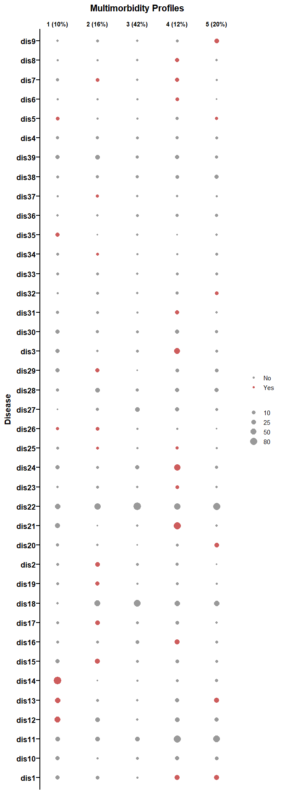
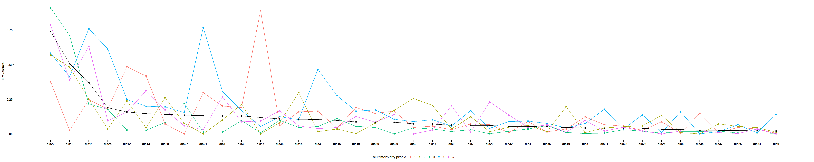

<!-- README.md is generated from README.Rmd. Please edit that file -->

# MMLCA

<!-- badges: start -->
<!-- badges: end -->

**MMLCA** aims to simplify the identification of multimorbidity patterns
through user-friendly functions. Leveraging the power of Latent Class
Analysis (LCA) as implemented in the `poLCA` package, **MMLCA** provides
an accessible and efficient tool for researchers.

## Installation

You can install the development version of MMLCA from
[GitHub](https://github.com/) with:

``` r
# install.packages("devtools")
devtools::install_github("ARCbiostat/MMLCA")
```

## Overview of the package

For the index of all functions, please visit the [Reference
Documentation](docs/reference/index.html).

## Example

This is an example with all the steps to identify MM patterns using LCA.

### Preparation

Load the package and the data:

``` r
library(MMLCA)
#> Warning: replacing previous import 'magrittr::extract' by 'tidyr::extract' when
#> loading 'MMLCA'
```

``` r
data(mmdata)
```

Prepare the dataset:

``` r
X <- prepare_data(mmdata, dis_string = "dis", keepmm = T)
#> 139 rows are removed because corrisponding to subjects having less than 2 chornic conditions.
#> rows removed: 37rows removed: 45rows removed: 51rows removed: 73rows removed: 75rows removed: 79rows removed: 100rows removed: 131rows removed: 154rows removed: 155rows removed: 177rows removed: 210rows removed: 243rows removed: 244rows removed: 250rows removed: 254rows removed: 263rows removed: 292rows removed: 305rows removed: 314rows removed: 354rows removed: 439rows removed: 445rows removed: 456rows removed: 470rows removed: 477rows removed: 482rows removed: 509rows removed: 530rows removed: 544rows removed: 564rows removed: 568rows removed: 585rows removed: 610rows removed: 631rows removed: 636rows removed: 738rows removed: 793rows removed: 824rows removed: 881rows removed: 895rows removed: 904rows removed: 931rows removed: 979rows removed: 992rows removed: 1008rows removed: 1052rows removed: 1098rows removed: 1121rows removed: 1134rows removed: 1162rows removed: 1175rows removed: 1196rows removed: 1202rows removed: 1208rows removed: 1229rows removed: 1232rows removed: 1279rows removed: 1334rows removed: 1387rows removed: 1444rows removed: 1445rows removed: 1450rows removed: 1485rows removed: 1500rows removed: 1506rows removed: 1528rows removed: 1570rows removed: 1572rows removed: 1576rows removed: 1605rows removed: 1607rows removed: 1626rows removed: 1637rows removed: 1661rows removed: 1690rows removed: 1693rows removed: 1717rows removed: 1729rows removed: 1741rows removed: 1743rows removed: 1749rows removed: 1804rows removed: 1811rows removed: 1821rows removed: 1838rows removed: 1864rows removed: 1878rows removed: 1905rows removed: 1960rows removed: 1967rows removed: 1986rows removed: 2040rows removed: 2041rows removed: 2061rows removed: 2089rows removed: 2108rows removed: 2130rows removed: 2134rows removed: 2143rows removed: 2145rows removed: 2152rows removed: 2157rows removed: 2160rows removed: 2192rows removed: 2217rows removed: 2247rows removed: 2264rows removed: 2298rows removed: 2323rows removed: 2327rows removed: 2338rows removed: 2362rows removed: 2421rows removed: 2436rows removed: 2443rows removed: 2467rows removed: 2478rows removed: 2495rows removed: 2503rows removed: 2519rows removed: 2528rows removed: 2554rows removed: 2565rows removed: 2574rows removed: 2600rows removed: 2638rows removed: 2646rows removed: 2652rows removed: 2667rows removed: 2701rows removed: 2761rows removed: 2794rows removed: 2811rows removed: 2812rows removed: 2834rows removed: 2849rows removed: 2858rows removed: 2893
```

The chronic diseases data has 2761 subjects since we removed individuals
with only one chronic condition.

Select the conditions to include in the LCA based on the prevalence:

``` r
threshold <- 0.02 # 2% prevalence
disease_names <- select_conditions(X,
  threshold = threshold
)

disease_names
#>  [1] "dis1"  "dis2"  "dis3"  "dis4"  "dis5"  "dis6"  "dis7"  "dis8"  "dis9" 
#> [10] "dis10" "dis11" "dis12" "dis13" "dis14" "dis15" "dis16" "dis17" "dis18"
#> [19] "dis19" "dis20" "dis21" "dis22" "dis23" "dis24" "dis25" "dis26" "dis27"
#> [28] "dis28" "dis29" "dis30" "dis31" "dis32" "dis33" "dis34" "dis35" "dis36"
#> [37] "dis37" "dis38" "dis39"
```

Divide the data in train/test

``` r
set.seed(202112)
train <- sample(1:nrow(X), round(nrow(X) * 0.7))
test <- setdiff(1:nrow(X), train)
```

### Run the LCA

Run the LCA with different number of classes and compare the metrics:

``` r
res <- select_number_LCA(
  nclasses = 2:7,
  X = X[train, ],
  conditions = disease_names,
  nrep = 5
)
```


**Note**: a higher number of repetitions may be needed. Default is 50.
See the documentation for further details.

Compare the classification accuracy on the train vs. test data:

``` r
ggacc <- ggaccuracy_LCA(res, test = X[test, ])
```


### Interpretation of the MM patterns

We now consider the result with 5 classes and try different method to
characterize the patterns in terms of over expressed diseases.

**Method 1:** O/E and Exclusivity:

``` r

OEx_sol5 <- ggOEx(res$obj[[4]], table = F)
```


**Method 2:** O/E and overall prevalence:

``` r

OE_sol5 <- ggOE(res$obj[[4]], table = F)
```


Same method but with 95% CI:

``` r
OEx_sol5 <- ggOE(res$obj[[4]], table = F,boot = T)
```


**Method 3:**

``` r

prev_sol5 <- ggprev(res$obj[[4]])
```



**Method 4:**

``` r

prev_sol5 <- ggprev_spaghetti(res$obj[[4]])
```



### Assignment of subjects into the latent classes

**Warning**: If additional analyses are performed, it is recommended to
take into account for the uncertainty in the classification.

``` r
mm_pattern <- assign_LCA(res$obj[[4]],X)
table(mm_pattern)
#> mm_pattern
#>    1    2    3    4    5 
#>  267  467 1160  322  545
```
