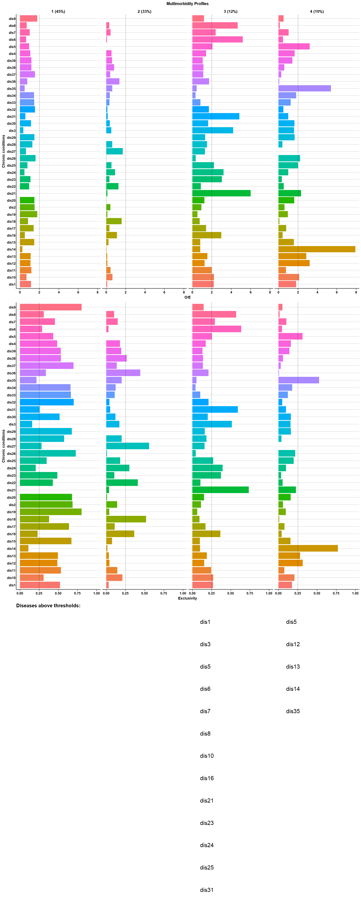
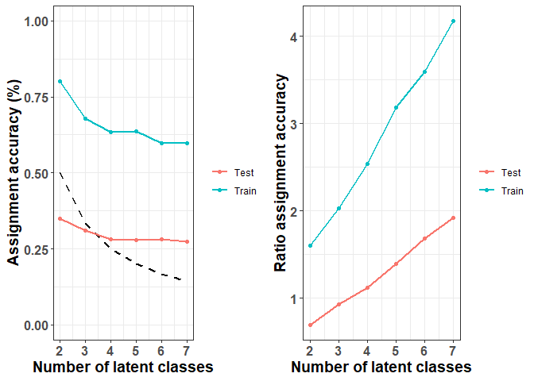
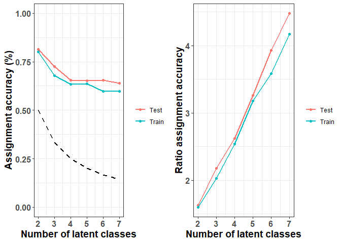
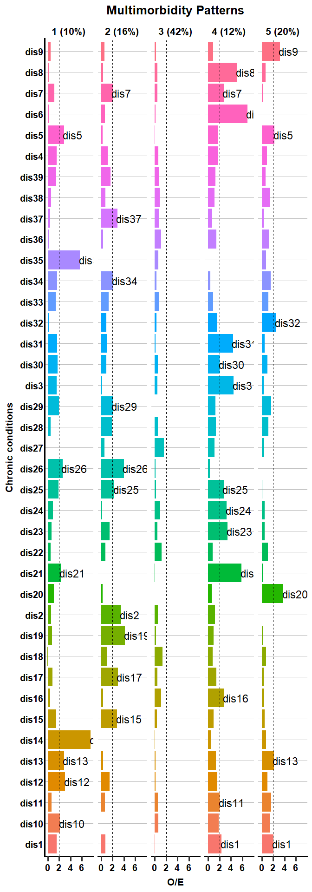
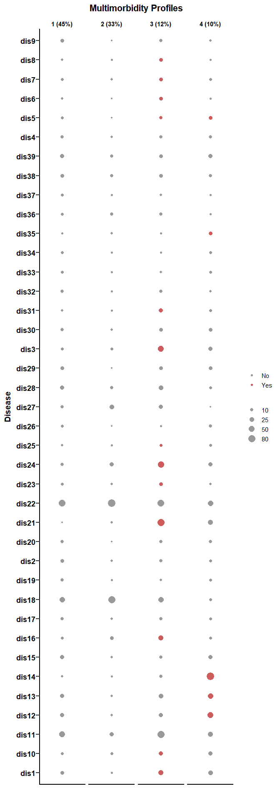

<!-- README.md is generated from README.Rmd. Please edit that file -->

# MMLCA

<!-- badges: start -->
<!-- badges: end -->

**MMLCA** aims to simplify the identification of multimorbidity patterns
through user-friendly functions. Leveraging the power of Latent Class
Analysis (LCA) as implemented in the `poLCA` package, **MMLCA** provides
an accessible and efficient tool for researchers.

## Installation

You can install the development version of MMLCA from
[GitHub](https://github.com/) with:

``` r
# install.packages("devtools")
devtools::install_github("ARCbiostat/MMLCA")
```

## Overview of the package

For the index of all functions, please visit the [Reference
Documentation](docs/reference/index.html).

## Example

This is an example with all the steps to identify MM patterns using LCA.

### Preparation

Load the package and the data:

``` r
library(MMLCA)
#> Warning: replacing previous import 'magrittr::extract' by 'tidyr::extract' when
#> loading 'MMLCA'
data(mmdata)
```

Prepare the dataset:

``` r
X <- prepare_data(mmdata, dis_string = "dis", keepmm = T)
#> 139 subject are removed because having less than 2 chornic conditions.
```

The chronic diseases data has 2761 subjects since we removed individuals
with only one chronic condition.

Select the conditions to include in the LCA based on the prevalence:

``` r
threshold <- 0.02 # 2% prevalence
disease_names <- select_conditions(X,
  threshold = threshold
)

disease_names
#>  [1] "dis1"  "dis2"  "dis3"  "dis4"  "dis5"  "dis6"  "dis7"  "dis8"  "dis9" 
#> [10] "dis10" "dis11" "dis12" "dis13" "dis14" "dis15" "dis16" "dis17" "dis18"
#> [19] "dis19" "dis20" "dis21" "dis22" "dis23" "dis24" "dis25" "dis26" "dis27"
#> [28] "dis28" "dis29" "dis30" "dis31" "dis32" "dis33" "dis34" "dis35" "dis36"
#> [37] "dis37" "dis38" "dis39"
```

Divide the data in train/test

``` r
set.seed(202112)
train <- sample(1:nrow(X), round(nrow(X) * 0.7))
test <- setdiff(1:nrow(X), train)
```

### Run the LCA

Run the LCA with different number of classes and compare the metrics:

``` r
res <- select_number_LCA(
  nclasses = 2:7,
  X = X[train, ],
  conditions = disease_names,
  nrep = 5
)
```



Compare the classification accuracy on the train vs. test data:

``` r
ggacc <- ggaccuracy_LCA(res, test = X[test, ])
```



### Interpretation of the MM patterns

We now consider the result with 5 classes and try different method to
characterize the patterns in terms of over expressed diseases.

**Method 1:** O/E and Exclusivity:

``` r

OEx_sol5 <- ggOEx(res$obj[[4]], table = F)
```



**Method 2:** O/E and overall prevalence:

``` r

OE_sol5 <- ggOE(res$obj[[4]], table = F)
```



**Method 3:**

``` r

prev_sol5 <- ggprev(res$obj[[4]])
```



### Assignment of subject into the latent classes

**Warning**: If following analyses are performed, it is recommended to
take into account for the uncertainty in the classification.

``` r
mm_pattern <- assign_LCA(res$obj[[4]],X)
table(mm_pattern)
#> mm_pattern
#>    1    2    3    4    5 
#>  425 1087  555  207  487
```
