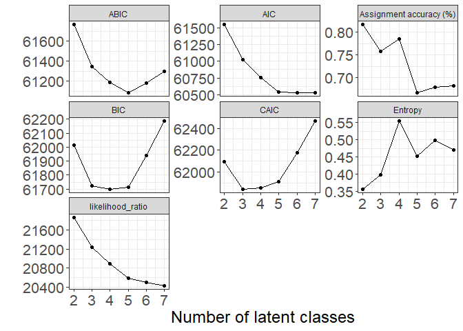

<!-- README.md is generated from README.Rmd. Please edit that file -->

# MMLCA: an R package to identify multimorbidity patterns

# 

<!-- badges: start -->

<!-- badges: end -->

**MMLCA** aims to simplify the identification of multimorbidity patterns
through user-friendly functions. Leveraging the power of Latent Class
Analysis (LCA) as implemented in the `poLCA` package, **MMLCA** provides
an accessible and efficient tool for researchers.

## Installation

You can install the development version of MMLCA from
[GitHub](https://github.com/) with:

``` r
# install.packages("devtools")
devtools::install_github("ARCbiostat/MMLCA")
```

## Overview of the package

## Overview of the package

Main functions are grouped into four analytical steps:

- **Data preparation**
  - `prepare_data()`
  - `select_conditions()`
- **Estimation and model selection**
  - `fit_mmlca()`
  - `select_mmlca()`
  - `ggaccuracy()` -`ggentropy()` -`ggcompare_classes()`
- **Pattern interpretation**
  - `ggOE()`
  - `ggOEx()`
  - `ggOEx_adaptive()`
  - `ggprev()`
  - `ggprev_spaghetti()`
- **Subsequent analyses**
  - `assign_mmlca()`
  - `impute_mmlca()`

Legacy function names remain supported for backward compatibility.

For the complete index of functions, please visit the
docs/reference/index.html.

## Example

This is an example with all the steps to identify MM patterns using LCA.

### Preparation

Load the package and the data:

``` r
library(MMLCA)
#> Warning: replacing previous import 'magrittr::extract' by 'tidyr::extract' when
#> loading 'MMLCA'
data(mmdata)
```

Prepare the dataset:

``` r
X <- prepare_data(mmdata, dis_cols = "dis", keepmm = T)
#> Number of disease columns detected: 59
#> 139 rows are removed because corrisponding to subjects having less than 2 diseases.
```

The chronic diseases data has 2761 subjects since we removed individuals
with only one chronic condition.

Select the conditions to include in the LCA based on the prevalence:

``` r
threshold <- 0.02 # 2% prevalence
disease_names <- select_conditions(X,
  threshold = threshold
)

disease_names
#>  [1] "dis1"  "dis2"  "dis3"  "dis4"  "dis5"  "dis6"  "dis7"  "dis8"  "dis9" 
#> [10] "dis10" "dis11" "dis12" "dis13" "dis14" "dis15" "dis16" "dis17" "dis18"
#> [19] "dis19" "dis20" "dis21" "dis22" "dis23" "dis24" "dis25" "dis26" "dis27"
#> [28] "dis28" "dis29" "dis30" "dis31" "dis32" "dis33" "dis34" "dis35" "dis36"
#> [37] "dis37" "dis38" "dis39"
```

### Run the LCA

Run the LCA with different number of classes and compare the metrics:

``` r
res <- select_mmlca(
  nclasses = 2:7,
  X = X,
  conditions = disease_names,
  nrep = 10
)
```



It is important to check that the number of repetition is enough.

### Interpretation of the MM patterns

We now consider the result with 5 classes and try different method to
characterize the patterns in terms of over expressed diseases.

**Method 1:** O/E and Exclusivity:

``` r
OEx_sol4 <- ggOEx(res$obj$`4classes`, table = F)
#> [1] "Diseases above threshold:"
#>    Multimorbidity profile Disease
#> 1                 2 (12%)    dis1
#> 2                 2 (12%)    dis3
#> 3                 2 (12%)    dis5
#> 4                 2 (12%)    dis6
#> 5                 2 (12%)    dis7
#> 6                 2 (12%)    dis8
#> 7                 2 (12%)   dis10
#> 8                 2 (12%)   dis16
#> 9                 2 (12%)   dis21
#> 10                2 (12%)   dis23
#> 11                2 (12%)   dis24
#> 12                2 (12%)   dis25
#> 13                2 (12%)   dis31
#> 14                3 (10%)    dis5
#> 15                3 (10%)   dis12
#> 16                3 (10%)   dis13
#> 17                3 (10%)   dis14
#> 18                3 (10%)   dis35
```

**Method 2:** O/E and overall prevalence:

``` r
OE_sol4 <- ggOE(res$obj$`4classes`, table = F)
```


Same method but with 95% CI:

``` r
OEx_sol4 <- ggOE(res$obj$`4classes`, table = F, ci = T)
```


**Method 3:**

``` r
OExa_sol4 <- ggOEx_adaptive(res$obj$`4classes`, table = F)
#> [1] "Diseases above threshold:"
#>    Multimorbidity profile index Disease
#> 1                 1 (45%)     1   dis19
#> 2                 1 (45%)     2    dis9
#> 3                 1 (45%)     3   dis26
#> 4                 1 (45%)     4   dis32
#> 5                 1 (45%)     5   dis37
#> 6                 1 (45%)     6    dis2
#> 7                 1 (45%)     7   dis20
#> 8                 1 (45%)     8   dis29
#> 9                 1 (45%)     9   dis15
#> 10                1 (45%)    10   dis33
#> 11                1 (45%)    11   dis34
#> 12                1 (45%)    12   dis17
#> 13                1 (45%)    13   dis28
#> 14                1 (45%)    14   dis38
#> 15                1 (45%)    15   dis11
#> 16                1 (45%)    16   dis39
#> 17                1 (45%)    17    dis1
#> 18                1 (45%)    18   dis30
#> 19                1 (45%)    19   dis13
#> 20                1 (45%)    20   dis23
#> 21                1 (45%)    21   dis12
#> 22                1 (45%)    22    dis4
#> 23                1 (45%)    23    dis7
#> 24                2 (12%)     1   dis21
#> 25                2 (12%)     2    dis6
#> 26                2 (12%)     3   dis31
#> 27                2 (12%)     4    dis8
#> 28                2 (12%)     5    dis3
#> 29                2 (12%)     6   dis24
#> 30                2 (12%)     7   dis23
#> 31                2 (12%)     8   dis16
#> 32                2 (12%)     9    dis7
#> 33                2 (12%)    10   dis25
#> 34                2 (12%)    11   dis10
#> 35                2 (12%)    12    dis1
#> 36                2 (12%)    13    dis5
#> 37                2 (12%)    14   dis11
#> 38                3 (10%)     1   dis14
#> 39                3 (10%)     2   dis35
#> 40                3 (10%)     3   dis12
#> 41                3 (10%)     4    dis5
#> 42                3 (10%)     5   dis13
#> 43                3 (10%)     6   dis21
#> 44                3 (10%)     7   dis26
#> 45                3 (10%)     8   dis10
#> 46                3 (10%)     9   dis25
#> 47                3 (10%)    10   dis34
#> 48                3 (10%)    11    dis1
#> 49                4 (33%)     1   dis27
#> 50                4 (33%)     2   dis18
#> 51                4 (33%)     3   dis36
#> 52                4 (33%)     4   dis22
#> 53                4 (33%)     5   dis16
```

**Method 4:**

``` r
prev_sol4 <- ggprev(res$obj$`4classes`)
```


**Method 5:**

``` r
prev_sol4 <- ggprev_spaghetti(res$obj$`4classes`)
```


### Assignment of subjects into the latent classes

**Warning**: If additional analyses are performed, it is recommended to
take into account for the uncertainty in the classification.

``` r
mm_pattern <- assign_mmlca(res$obj$`4classes`, X)
table(mm_pattern)
#> mm_pattern
#>    1    2    3    4 
#> 1251  338  270  902
```

### Multiple imputation

``` r
mm_patterns_imputed <- impute_mmlca(res$obj$`4classes`, X)
```
